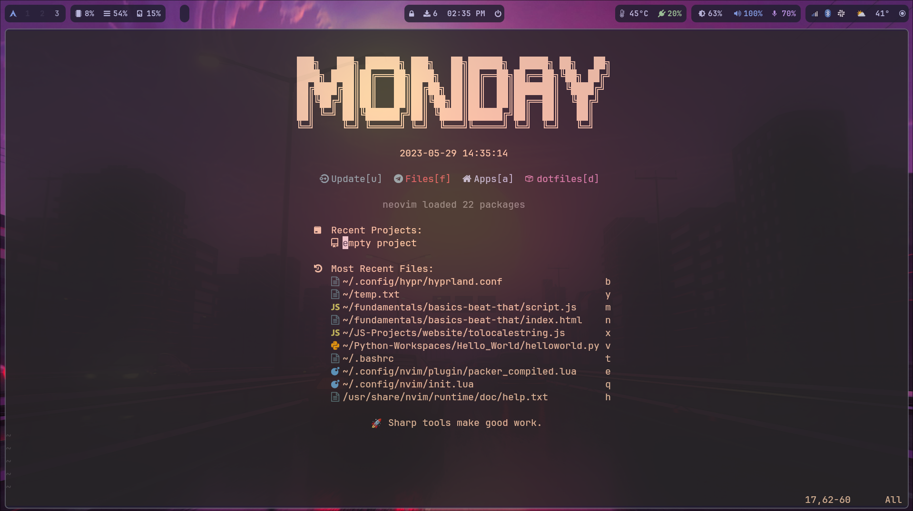

# Neovim-Config-Files
dotfile(s) for my nvim setup. 

for conqueror of completion do remember to install yarn, then find your coc.nvim folder. 
within that folder run: 
`yarn install` & `yarn build` 
then install language servers with your package manager. For example if you want python, install jedi. 

then within nvim, run `:CocInstall coc-python` for example if you want python autocomplete. `CTRL+Y` input will carry out the autocomplete. 

Screenshots: 

For startup screen

